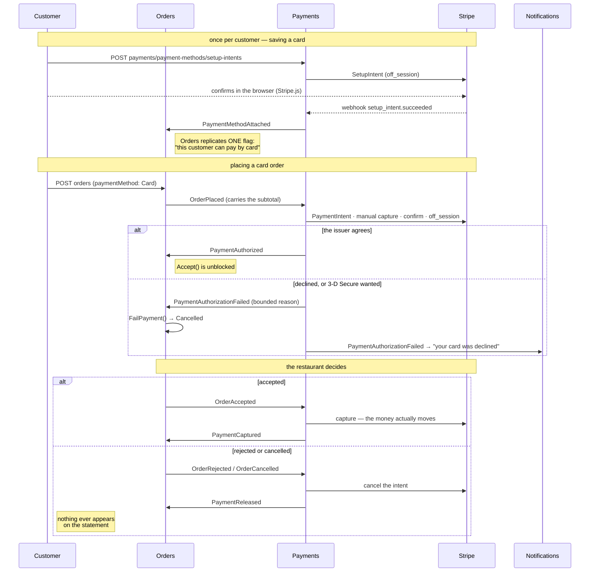
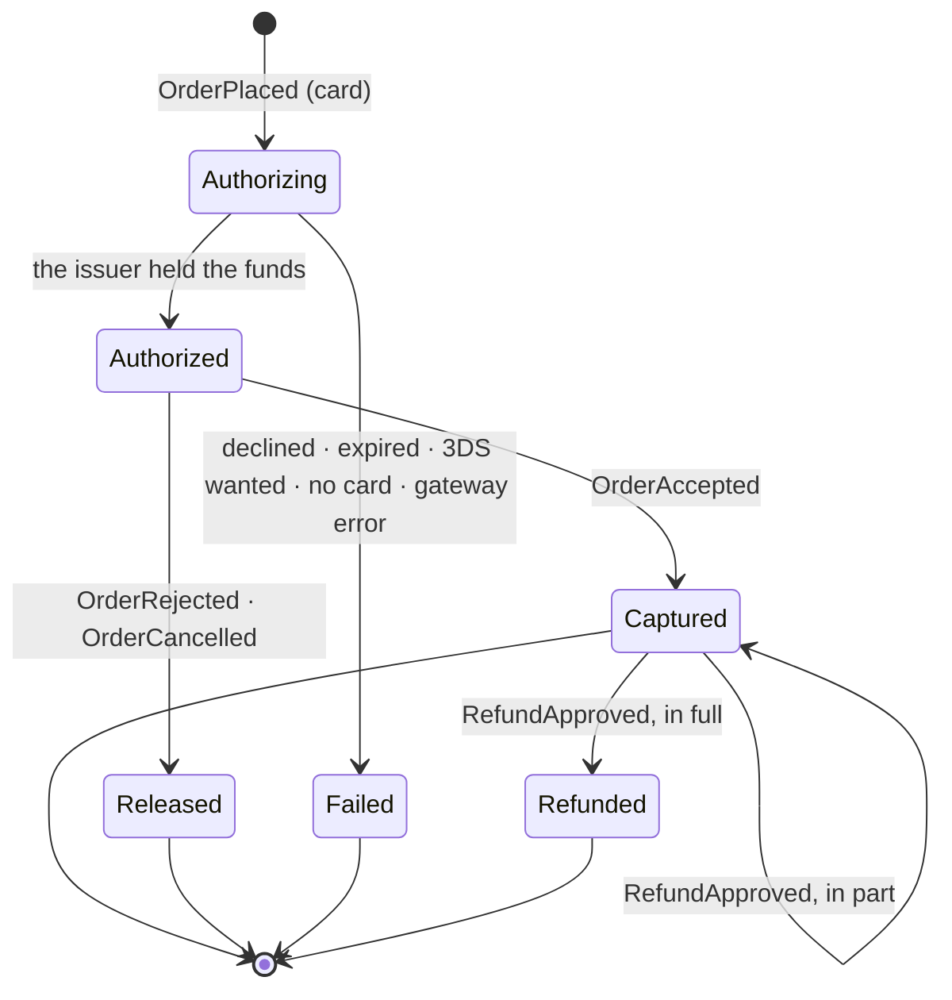

# Card payments, holds, captures and refunds

> Delivered by **Feature 3.8 — Payments & Stripe** (`PAYMENTS_PHASE3_PLAN.md`). The Payments service
> is `fooddeliveryservice.payments.api` on `:5800`, database `fooddeliveryservice_payments`, routed
> at `payments/**` through the Gateway. Eighth module, tenth host.

This service holds money on a customer's card when an order is placed, takes it when the restaurant
accepts, gives the hold back when the order is rejected or cancelled, and sends money back when an
administrator approves a refund. It is the one service in the platform whose bugs cost people money,
and everything below is organised around that.

Three things stated up front, because all three are usually assumed the other way:

- **No real money moves, ever.** The platform runs against Stripe **test keys** (`sk_test_…`). Test
  mode has no bank account behind it and cannot reach one; `StripeOptionsValidator` refuses a
  live-mode key at startup so that "just this once" is not available. §8.
- **The backend never sees a card number.** Not a PAN, not a CVC, not an expiry date. It stores
  Stripe identifiers and the brand and last four digits for display. An endpoint that accepted raw
  card data would be a defect, not a feature. §7.
- **A refund is Support's decision and this service's transfer.** Support owns who may ask and who
  may agree; Payments owns whether the money can actually go back and says so. Neither can do the
  other's half. §6.

---

## 1. The flow, end to end



The refund leg is the same shape across a different pair of services, and lives in §6.

**Every arrow between two services is an integration event over the outbox/inbox**, never a call.
Payments never asks Orders anything and Orders never asks Payments; each keeps the one fact it needs
from the other as a local replica fed by full snapshots (hard rules #4, #9). The two arrows to Stripe
are the only synchronous calls in the picture.

**Authorization is not a step in the order lifecycle.** Orders carries a second, orthogonal
`PaymentStatus` column and exactly one guard — `Order.Accept()` refuses while a card order is not yet
authorized. There is no `OrderStatus.AwaitingPayment`: `OrderStatus` is consumed by Delivery,
projected into Support's timeline, pushed as RealTime frames and asserted by four integration suites,
and a ninth member would ripple into all of them for no behavioural gain. A cash order is
`PaymentStatus.NotRequired` for its whole life and nothing in this service ever hears about it.

---

## 2. The `Payment` state machine

One row per order, created **before** the Stripe call rather than after it.



**`Authorizing` is written first on purpose.** A crash between the Stripe call and the transaction
that would have recorded its answer leaves a row the reconciling webhook can find. A payment the
provider knows about and this platform does not is the one state there is no recovery from, and
writing the row first is what makes it impossible.

**Four states are terminal, and every mutation from one of them returns success without acting.**
That is not politeness. The outbox and the webhook both drive these transitions, both are
at-least-once, and a second capture of a captured payment is a second charge. The idempotency key
(§3) is the second line of defence; this is the first.

**The refund bends that rule, and only that rule.** `Captured` is terminal, yet a refund works from
it — a refund is not a repeat of the capture, it is the only thing that may legitimately follow one.
The idempotency the terminal rule carries elsewhere is carried here by a unique index on
`refund_request_id` instead. A partial refund leaves the payment `Captured`, because the status says
where the money is; only the last cent moves it to `Refunded`.

**A cash order has no row at all.** Absence means "nothing to do" on the capture and release paths —
both return success — and it means `not_card_payment` on the refund path, where it is a failure worth
publishing (§6). The events those paths ride on do not carry a payment method, so the missing row
*is* how a cash order is recognised.

### The six failure reasons

`Payment.FailureReason` is bounded to `PaymentFailureReason`, and the aggregate refuses anything
else. The same six strings reach the integration event, the customer's email and the `reason` tag on
`payments.failed` — one vocabulary, no translation step.

| Reason | What happened | Whose problem |
|---|---|---|
| `card_declined` | the issuer declined without saying why | the customer's |
| `insufficient_funds` | the issuer declined for want of funds | the customer's |
| `expired_card` | the saved card has expired | the customer's |
| `authentication_required` | the card wants 3-D Secure and nobody is present to answer it | nobody's — see §10 |
| `no_payment_method` | there was no saved card to charge | Orders' replica, a second stale |
| `gateway_error` | malformed request, rejected API key, unmapped Stripe error | **ours** |

Stripe's own `StripeError.Message` never reaches any of those places. It is unbounded third-party
free text — one time series per distinct message on a metric tag, and customer-facing prose written
by somebody else on an email. It is logged, and that is all.

---

## 3. The two rules

Both exist because the same message can be delivered twice and the same row can be written by two
processes at once. Neither is a style preference; each one is a double charge if it lapses.

### Rule 1 — every mutating provider call carries an idempotency key built from a durable id

`ProcessOutboxJob` and `ProcessInboxJob` are at-least-once. A retried capture without a key is a
second charge. `IPaymentGateway` therefore takes `idempotencyKey` as a **required parameter** on every
method rather than computing one internally: an omission has to be a compile error, not a code-review
catch. `StripePaymentGateway.InvokeAsync` additionally refuses a blank key, because Stripe silently
ignores an empty `Idempotency-Key` header and a blank one is no protection at all wearing the shape
of protection.

| Operation | Key | Durable id it comes from |
|---|---|---|
| Authorize | `order-auth-{orderId}` | the order |
| Capture | `order-capture-{orderId}` | the order |
| Release | `order-release-{orderId}` | the order |
| Refund | `refund-{refundRequestId}` | Support's refund request |
| Create customer | `customer-{userId}` | the user |
| Attach card | `pm-attach-{paymentMethodId}` | Stripe's own `pm_…` |
| Detach card | `pm-detach-{paymentMethodId}` | Stripe's own `pm_…` |
| Start card collection | `setup-{attemptId}` | **an attempt id, not a durable one** — see below |

Never `Guid.NewGuid()` at the call site, never a timestamp. The one apparent exception is the
SetupIntent: starting card collection twice is two genuine attempts by a customer who changed their
mind, so the key is per attempt by design rather than by oversight.

### Rule 2 — every payment mutation takes `IDistributedLock` before the read

The webhook handler and the outbox handler are two processes racing on one row, and **no aggregate in
this codebase carries an optimistic concurrency token**, so Postgres will not reject the second write.
Every transition here is check-then-act — read the status, decide, write — so the lock is acquired
*before* the read, because a lock taken after it still lets both callers act on the same stale
snapshot.

One key per order, from `PaymentLocks.Payment(orderId)`, with a 30-second TTL. One key, not one per
operation: a capture and a release racing on the same order is exactly the race worth losing, and two
names for one row would let both proceed.

A lost acquisition returns a failure rather than a quiet success. It has to, because
`ProcessInboxJob` does **not** retry — it records the error on the message row and marks it processed
— so a swallowed contention would strand the payment with nothing to re-drive it. The recovery path
is the reconciling webhook (§5), which is why §5 is a correctness requirement of this service rather
than a refinement of it.

---

## 4. The API surface

Four authenticated endpoints and one anonymous one. Everything else this service does is driven by
integration events or by Stripe.

| Endpoint | Permission | What it does |
|---|---|---|
| `POST payments/payment-methods/setup-intents` | `payment-methods:manage` | starts card collection; returns a client secret for Stripe.js |
| `GET payments/payment-methods` | `payment-methods:manage` | the customer's saved cards, brand and last four only |
| `DELETE payments/payment-methods/{id}` | `payment-methods:manage` | forgets a card, at Stripe and here |
| `POST payments/payment-methods/test-cards` | `payment-methods:manage` | attaches a Stripe test token (`pm_card_visa`) server-side — there is no frontend, and §8 explains why this exists |
| `POST payments/webhooks/stripe` | **anonymous** | Stripe's event ingress; authenticated by signature, not by token |

`payments:read` and `payments:administer` are seeded by Milestone A and carried by no endpoint yet —
see §10.

The permission namespace is deliberately its own. Widening `refunds:approve` to also mean "can see
payments" would hand payment visibility to every senior support agent, which is the privilege leak
the separate `support-*` namespace was carved out to avoid in the first place.

---

## 5. Webhooks, and why they are the recovery path

```
Stripe ──▶ POST payments/webhooks/stripe
             │  raw body read from the stream (a re-serialised body fails the signature)
             │  signature verified against the endpoint secret
             │  event id INSERTed into stripe_event_log — a replay collides and returns 200
             ▼
        outbox ──▶ StripeEventReceivedDomainEventHandler ──▶ one command per event type
```

Five things about this path are load-bearing:

- **The signature is computed over the exact bytes Stripe sent.** The endpoint reads the raw request
  stream; model binding it and re-serialising changes the whitespace and the signature fails on a
  perfectly genuine event.
- **The dedupe is a table, not the inbox.** `inbox_messages` protects MassTransit deliveries; this
  event never touched the broker. `stripe_event_log` has a unique index on the provider's `evt_…` and
  a replay is a collision, answered `200` without acting.
- **The endpoint is exempt from the edge rate limiter.** Stripe delivers from a shared pool of source
  addresses, so the anonymous per-IP bucket would shed genuine webhooks as if they were one abusive
  client.
- **It returns 2xx fast, and does the work afterwards.** Stripe's delivery timeout is about twenty
  seconds and the work needs Stripe round trips of its own. The endpoint records and returns; the
  outbox acts.
- **Arrival order carries no meaning**, so every dispatch arm is independently idempotent. An
  unrecognised event type is recorded, marked processed and acted on by nothing — turning it into a
  failure would mean anything enabled in the Stripe dashboard takes the endpoint to a `400` and
  Stripe into backoff.

The four types subscribed to: `setup_intent.succeeded` (the card is attached — this event *is* the
attachment, not the endpoint that started it), `payment_intent.amount_capturable_updated` (the hold
is on), `payment_intent.succeeded` (the money moved) and `payment_intent.payment_failed`.

In the ordinary case the last three are redundant, because the API response already recorded what
they say and the arm is a no-op. They earn their place in the case that matters: the response was
lost, the process died, or the transaction rolled back. Neither the outbox nor the inbox job retries
a failed dispatch, so this is not a second belt on the same braces — **it is the only thing that
finishes such a payment.** `payments.webhook.lag` (§9) exists to say when it is keeping up.

---

## 6. Refunds

```
agent ──asks──▶ Support ──a DIFFERENT administrator approves──▶ RefundApproved
                                                                     │
                                                    Payments ◀───────┘
                                                        │  Captured?  within the captured amount?
                                                        ├──▶ Stripe refund ──▶ RefundSettled ──▶ Support closes it
                                                        │                                   └──▶ the customer is emailed
                                                        └──▶ RefundFailed ──▶ Support reopens the decision for a human
```

**Every refusal is published, not swallowed.** All three guards — a cash order, a payment that was
never captured, an amount above what is left — write a `Refund` row in `Failed`, publish
`RefundFailedIntegrationEvent` and return **success** from the handler. There is a person waiting: an
agent has told a customer their money is coming back, and an approved request stuck at "approved"
forever is the exact failure this whole leg exists to remove. Throwing would put the reason on an
inbox row nobody reads.

| Failure reason | What it means | Who fixes it |
|---|---|---|
| `not_card_payment` | the order was paid in cash | somebody in the business, by hand |
| `payment_not_captured` | the hold was released, or never taken | nobody — there is nothing to give back |
| `amount_exceeds_captured` | more was asked for than is left | the agent, with a smaller request |
| `gateway_error` | Stripe was asked and did not do it | us |

**The refund is keyed on the order and carries no payment id.** The order is the handle every writer
in this module already has — it *is* the lock key — one order has at most one payment, and a refund
approved for a cash order has no payment to point at while still being worth recording.

**Support caps the request; Payments caps the transfer.** Support's ceiling is the replicated order
subtotal, checked when the request is raised. This service's ceiling is what was actually captured
minus what has already gone back, checked when the money is about to move. They are different numbers
answering different questions and both are needed.

**A Stripe refund reported as `pending` is treated as settled.** The money is committed, this
platform subscribes to no `charge.refund.updated` webhook that would ever move it on, and holding
Support's request mid-air for a refund that is going to arrive is a worse answer than settling a few
days early. A refund later reversed by the issuer is outside what this feature models.

**Notifications hears about two of the three outcomes.** `PaymentAuthorizationFailed` becomes the
declined-card email and `RefundSettled` becomes "your refund has been sent". `RefundFailed` is
deliberately not consumed: three of its four reasons need a person inside the business and none are
things a customer can act on, so the agent working the ticket learns about it first.

---

## 7. PCI scope

**SAQ-A, and it must stay there.**

| Never touches this platform | Stored here |
|---|---|
| the card number (PAN) | `cus_…`, `pm_…`, `pi_…`, `re_…` — Stripe identifiers |
| the CVC | the card brand, for display |
| the expiry date | the last four digits, for display |

Card data goes from the customer's browser to Stripe directly, and what comes back to this service is
a token. That is the entire reason for the SetupIntent dance in §1: it exists so that the backend can
charge a card it has never seen. Any endpoint that would accept raw card data takes the platform out
of SAQ-A and into a compliance regime this project has no business being in — it is a defect.

See also `docs/security.md`.

---

## 8. Running it locally

Two secrets, neither of which goes anywhere near `appsettings.json`:

```bash
cd Backend/src/API/FoodDeliveryService.Payments.Api
dotnet user-secrets set "Stripe:SecretKey" "sk_test_..."
dotnet user-secrets set "Stripe:WebhookSecret" "whsec_..."
```

Sign up at Stripe, stay in **test mode**, and both are available immediately with no business
verification and no bank account. `AddRequiredConfiguration` fails the host at boot outside
Development if either is missing, and `StripeOptionsValidator` fails it **everywhere** if the secret
key is a live one. `SecretHygieneTests` fails the build if `sk_test_`, `sk_live_`, `rk_live_` or
`whsec_` is ever committed.

Forward real test webhooks into the compose stack:

```bash
stripe listen --forward-to http://localhost:3000/payments/webhooks/stripe
```

It prints the signing secret to use for `Stripe:WebhookSecret`. Nothing needs deploying and nothing
needs tunnelling — this is what makes §5 exercisable on a laptop.

### Test cards

| Card | Behaviour |
|---|---|
| `4242 4242 4242 4242` | succeeds |
| `4000 0000 0000 9995` | declines — `insufficient_funds` |
| `4000 0025 0000 3155` | wants 3-D Secure — `authentication_required` |
| `pm_card_visa` | a token rather than a number; attachable server-side |

The last one is why `POST payments/payment-methods/test-cards` exists. Saving a card properly needs a
browser confirming a SetupIntent with Stripe.js, and this platform has no frontend; the endpoint
attaches one of Stripe's own test tokens so the rest of the flow can be driven end to end from a
terminal. It never accepts a card number — `pm_card_visa` is a token, which is the whole point.

### End to end, by hand

Wipe `.containers/db` first if the Payments database has never been created: `01-roles.sql` runs only
on an empty data directory, and without it the host fails to start on a confusing permission error.

1. `docker compose up -d`, then `stripe listen --forward-to http://localhost:3000/payments/webhooks/stripe`
2. attach `pm_card_visa` for a customer
3. place a card order, and watch `payment_intent.amount_capturable_updated` arrive
4. accept the order as the restaurant, and watch `payment_intent.succeeded`
5. confirm the test ledger in the Stripe dashboard

Follow the whole thing in Jaeger and Seq on a single correlation id — it survives both the broker and
the two database handoffs (`docs/observability-backend.md`).

---

## 9. Metrics

Seven instruments on `PaymentsDiagnostics` (`Payments.Application/Diagnostics`), registered by the
single `AddModuleDiagnostics(PaymentsDiagnostics.Name)` call in the host. An unregistered meter never
errors — it silently records into nothing, which on this service looks exactly like no money moving.

| Instrument | Tags | Recorded in | Prometheus name |
|---|---|---|---|
| `payments.authorized` (counter) | — | `PaymentAuthorizedDomainEventHandler` | `payments_authorized_total` |
| `payments.captured` (counter) | — | `PaymentCapturedDomainEventHandler` | `payments_captured_total` |
| `payments.failed` (counter) | `reason` | `PaymentAuthorizationFailedDomainEventHandler` | `payments_failed_total` |
| `payments.released` (counter) | `trigger` | `ReleasePaymentCommandHandler` | `payments_released_total` |
| `refunds.settled` (counter) | — | `RefundSettledDomainEventHandler` | `refunds_settled_total` |
| `payments.gateway.duration` (histogram, s) | `operation`, `outcome` | `StripePaymentGateway.InvokeAsync` | `payments_gateway_duration_seconds_*` |
| `payments.webhook.lag` (histogram, s) | `event_type` | `StripeEventReceivedDomainEventHandler` | `payments_webhook_lag_seconds_*` |

Four of the seven are recorded from a **domain-event handler** — the outbox path the state change
already takes — and always as the **last** statement, because `IdempotentDomainEventHandler` only
writes its consumer row once `Handle` returns, so a handler that throws is re-run whole and counting
first would inflate the series by every retry.

The three that are not are worth the explanation:

- **`payments.released` is recorded in the command handler**, because `PaymentReleasedDomainEvent`
  deliberately carries no reason — the money does not care whether the restaurant refused the order
  or the customer changed their mind. The trigger is known only where the inbox handler that sent the
  command knew it, so the command carries it and the measurement is taken after `SaveChangesAsync`,
  on the one path that actually released something.
- **`payments.gateway.duration` is infrastructure**, measured around the single seam every provider
  call passes through. There is no state change to hang it on, and a call that timed out and changed
  nothing is precisely the call it exists to show.
- **`payments.webhook.lag` is recorded first**, not last — the measurement is a wait that is already
  over by the time the handler runs, so taking it at the end would fold the work into the queueing it
  exists to isolate. It is also the one number still worth having when the dispatch below it fails.

Tag values are bounded constants only: an operation name, one of three outcomes, one of six failure
reasons, one of two triggers, one of four event types plus `other`. Never a Stripe message, never an
id, never an amount — the first two are cardinality explosions, and the third invites reading a
Grafana panel as a ledger.

The panels are on the **Business** dashboard (`docker/grafana/dashboards/business.json`, uid
`fds-business`) and the alerts in `docker/prometheus/rules/alerts.yml`, group
`fooddeliveryservice-payments`:

| Alert | Fires on | Severity |
|---|---|---|
| `HighPaymentFailureRate` | over a quarter of authorizations failing for 10 minutes | warning |
| `PaymentGatewayErrors` | any sustained rate of `reason="gateway_error"` | critical |
| `SlowPaymentGateway` | provider p95 above 5s, per operation | warning |
| `WebhookProcessingLag` | events waiting over two minutes to be acted on | warning |

The split between the first two is the whole point of the `reason` tag: a run of declines is the
customer base and no amount of paging fixes it, while a run of `gateway_error` means this platform is
refusing orders it could have taken. `ObservabilityAssetTests` fails the build if a dashboard or an
alert names a metric nothing emits, and `PaymentsDiagnosticsTests` is the other half — it fails if an
instrument is renamed out from under the PromQL, or if a tag stops being bounded.

---

## 10. Not built

- **No payouts.** Money arrives in the platform's Stripe balance and stays there. Paying restaurants
  is Stripe Connect and a feature in its own right — `Order.CommissionRate` is snapshotted at
  placement for exactly that, and `PAYMENTS_PHASE3_PLAN.md` §12 sketches it.
- **No on-session 3-D Secure retry.** A card that wants a challenge fails with
  `authentication_required` and the order is cancelled. Resuming the intent needs a browser to put
  the challenge in, which needs a frontend.
- **No multi-currency.** `Money` carries a currency code so the type is honest, but exactly one value
  ever flows through it (`Payments:Currency`, default `EUR`). The restaurant-and-customer mismatch
  problem does not exist yet.
- **No partial captures.** The capture takes the full authorized amount; an order whose contents
  changed after placement is not modelled. Partial *refunds* are supported.
- **No payment read endpoints.** `payments:read` and `payments:administer` are seeded and carried by
  nothing — a customer sees their payment state through the order, and an agent through the ticket.
  The codes exist so that adding the endpoints is an addition rather than a permission migration.
- **No `charge.refund.updated` subscription**, so a refund the issuer later reverses is invisible
  here. See §6.
- **No saved-card expiry handling.** A card that expires between being saved and being charged fails
  as `expired_card` at authorization time; nothing warns the customer beforehand.
