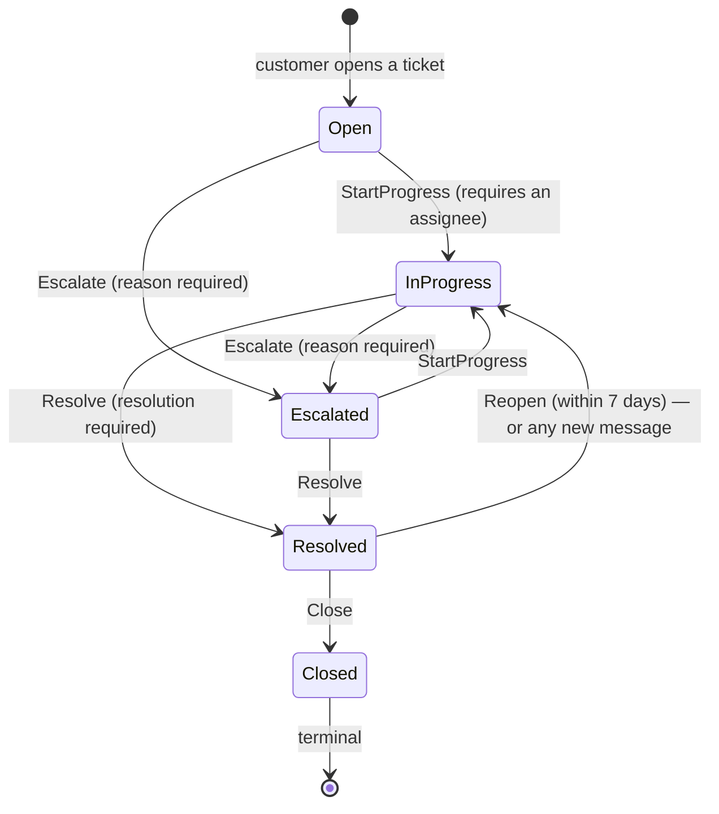

# Support tickets, refund requests and the audit log

> Delivered by **Feature 3.6 — Support Service & Ticketing** (`SUPPORT_PHASE3_PLAN.md`). The Support
> service is `fooddeliveryservice.support.api` on `:5700`, database `fooddeliveryservice_support`,
> routed at `support/**` through the Gateway. Seventh module, ninth host.

Everything a customer-support organisation does to an order after it has gone wrong lives here: the
case itself, who is working it, the conversation, the refund somebody asked for and somebody else
agreed to, and an append-only record of every one of those decisions.

Two things this service deliberately does **not** do, stated up front because both are usually
assumed:

- **It moves no money.** A `RefundRequest` records that an agent asked and an administrator agreed.
  The platform has no payment processing anywhere, and nothing in Orders consumes a refund event.
  See §6.
- **It never reads another service's data.** The order history an agent sees on a ticket is a local
  projection built from integration events Orders and Delivery already publish (hard rules #5, #9).

---

## 1. The ticket state machine

The transition table is the domain logic of this feature, and it lives in exactly one place:
`Ticket` (`Support.Domain/Tickets/Ticket.cs`). Every move returns a `Result` and never throws — an
illegal transition is an ordinary business failure the endpoint turns into a `400`. A no-op
(resolving an already-resolved ticket) is a failure too, and raises **no** domain event, so a
redundant call cannot put an integration event on the bus.



Rules the diagram cannot show:

| Rule | Where it lives | Why |
|---|---|---|
| `Open` is a birth state, never a destination | `ChangeTicketStatusCommandHandler` | A ticket needing work again goes to `InProgress` via `Reopen`, which keeps the agent who already has the context. |
| `StartProgress` and `Resolve` require an assignee | `Ticket` | Work that nobody owns is not in progress. |
| Reopen window: **7 days** after resolution | `Ticket.ReopenWindowInDays` | Past it the customer opens a new ticket, so a months-old case cannot silently re-enter the queue — or distort the average-resolution-time numerator. |
| A message on a `Resolved` ticket reopens it | `Ticket.PostMessage` | Otherwise a ticket is actively being discussed while still counting as resolved. This path deliberately bypasses the 7-day window: refusing it would lose the customer's message with it. It raises the same `TicketReopenedDomainEvent`, so both roads look identical to every consumer. |
| `Closed` accepts no messages | `Ticket.PostMessage` | A closed ticket has no assignee and no transition puts one back on it — a thread nobody is accountable for. |
| Assignment is **not** part of the status machine | `Claim` / `AssignTo` / `Unassign` | Claiming says who owns the ticket; `StartProgress` says work has begun. Conflating them makes "assigned but not yet started" unrepresentable. All three go through one internal setter, so there is exactly one place the assignee is ever written. |

`Ticket.Reference` (`SUP-00001234`) is the human-quotable identifier, allocated from a Postgres
sequence by the repository — never `MAX()+1`, which is a race the moment the service runs two
replicas.

### Claiming is a locked check-then-act

Two agents claiming the same ticket is textbook check-then-act on contended state, and **no
aggregate in this codebase carries an optimistic concurrency token** — the database will not reject
the second write. Claim and refund approval both take the `IDistributedLock` (`SupportLocks`),
acquired *before* the read, because the check-then-act begins at the read. The aggregate guard
(`if (AssignedAgentId is not null)`) is the rule of record; the lock only makes two callers observe
it in sequence. See `CLAUDE.md` § Distributed Locking.

---

## 2. Permissions

The codes are namespaced `support-*`, not `tickets:*`. Bare `tickets:read` / `tickets:check-in`
existed in `Permission.cs` as leftovers from an event-ticketing scaffold **and were granted to every
Customer**; reusing them would have handed support-agent access to the entire customer base. That
scaffold was deleted; these codes stand on their own.

| Code | Customer | SupportAgent | Administrator |
|---|:--:|:--:|:--:|
| `support-tickets:open` — open a ticket, reply on their own | ✅ | — | ✅ |
| `support-tickets:read` — read tickets and their threads | ✅ *(own only)* | ✅ | ✅ |
| `support-tickets:manage` — status transitions, internal notes, the audit log | — | ✅ | ✅ |
| `support-tickets:assign` — claim, hand back, assign to self | — | ✅ | ✅ |
| `support-tickets:administer` — assign a ticket to *somebody else* | — | — | ✅ |
| `refunds:request` — raise a refund request, read the queue | — | ✅ | ✅ |
| `refunds:approve` — decide a refund request | — | — | ✅ |
| `support-analytics:read` — the management summary | — | ✅ | ✅ |
| `support:dashboard` — join the live SignalR agent feed | — | ✅ | ✅ |

Two things this table encodes that are easy to get wrong:

- **`support-tickets:administer` is a separate code, not an inference.** Agents and administrators
  both hold `:assign`, so nothing in that code expresses "may route another agent's work". Inferring
  it from `refunds:approve` — the only other admin-only support code — would silently hand out ticket
  routing the day a senior agent is granted refund approval. It mirrors `deliveries:administer`.
- **A customer reading someone else's ticket gets `404`, not `403`.** A `403` confirms the ticket
  exists, which is exactly what a customer probing ticket ids is trying to learn. The narrowing is in
  the handler, from the authenticated identity — there is no filter value a caller can send that
  widens what they see. The one deliberate exception is `GET .../audit`, which returns `403` even for
  the caller's own ticket: they already know it exists, and internal reasons appear in the log.

**Where RBAC is actually enforced.** The Gateway validates the JWT and rejects unauthenticated
traffic before proxying; each service validates it again independently and resolves fine-grained
permissions through `GetUserPermissionsRequest` to Users. There is **no role claim in the token** —
Identity registers `IdentityRole` but assigns nothing and has no `IProfileService`, and the
authoritative role lives in the Users database. Coarse role filtering at the edge is therefore not
implemented; it is an optimisation, not the security boundary. `SUPPORT_PHASE3_PLAN.md` §10 sets out
what closing that would cost.

---

## 3. The API surface

| Method | Route | Permission |
|---|---|---|
| `POST` | `support/tickets` | `support-tickets:open` |
| `GET` | `support/tickets` | `support-tickets:read` |
| `GET` | `support/tickets/{id}` | `support-tickets:read` |
| `POST` | `support/tickets/{id}/status` | `support-tickets:manage` |
| `POST` | `support/tickets/{id}/claim` | `support-tickets:assign` |
| `POST` | `support/tickets/{id}/assign` | `support-tickets:assign` + `:administer` to name another agent |
| `POST` | `support/tickets/{id}/unassign` | `support-tickets:assign` |
| `GET` | `support/tickets/{id}/audit` | `support-tickets:manage` |
| `POST` | `support/tickets/{id}/messages` | `support-tickets:read` (an internal note additionally needs `:manage`) |
| `GET` | `support/tickets/{id}/messages` | `support-tickets:read` |
| `POST` | `support/tickets/{id}/refund-requests` | `refunds:request` |
| `GET` | `support/refund-requests` | `refunds:request` |
| `POST` | `support/refund-requests/{id}/approve` | `refunds:approve` |
| `POST` | `support/refund-requests/{id}/reject` | `refunds:approve` |
| `GET` | `support/analytics/summary` | `support-analytics:read` |

One status endpoint dispatching to the aggregate's methods, rather than five verb endpoints each
re-deriving which source states they are legal from — the aggregate already owns that table.

---

## 4. What the audit log guarantees

`SupportAuditEntry` is append-only: no update path, no delete path, and no domain events, because it
*is* the record.

```
Id · TicketId · ActorId · Action · FromValue · ToValue · Reason · OccurredOnUtc
```

`Action` is one of `StatusChanged`, `Assigned`, `Unassigned`, `Claimed`, `MessagePosted`,
`RefundRequested`, `RefundApproved`, `RefundRejected`.

Four properties, each of which is a deliberate design decision rather than an implementation detail:

1. **Written in the same `SaveChangesAsync` as the change it records** — via `ISupportAuditWriter`,
   called immediately before the save. Never from a domain-event handler: the outbox runs on its own
   schedule, so a handler-written entry could fail after the state change had already committed. A
   ticket whose history has a hole in it is precisely what this log exists to prevent.
2. **The actor is unforgeable.** `ActorId` and `OccurredOnUtc` are not parameters — the writer
   resolves them from `ISupportContext` and `IDateTimeProvider`. An audit log an agent can forge by
   sending a different id in the body is worse than none.
3. **No foreign key to `tickets`.** A cascade is the one thing that could ever delete an audit row,
   and an append-only log must have no delete path at all, transitive included. The read endpoint
   checks the ticket exists with its own statement, so an untouched ticket returns an empty history —
   a different answer from a ticket that does not exist.
4. **Over-long values are truncated, not rejected.** A failed audit write would roll back the state
   change it was recording, turning a cosmetic problem into a refused agent action.

The concurrency test for claiming asserts on **one** `Claimed` audit row, not on the pair of HTTP
status codes — that is what actually proves the lock held.

---

## 5. The order-context projection

Support keeps local replicas of everything it needs to render a case, all fed by integration events:

| Replica | Fed by | Built? |
|---|---|:--:|
| `SupportAgentReplica` (`support_agents`) | `UserRegistered`, `UserProfileUpdated` — agents and administrators only | ✅ |
| `OrderSnapshot` | `OrderPlacedIntegrationEvent` (customer, restaurant, **subtotal**, placed-on) | ✅ |
| `OrderSnapshot` status fields + `OrderTimelineEntry` | the remaining seven lifecycle events below | — |
| `Customer` | `UserRegistered`, `UserProfileUpdated` | — |

| Event | Effect on the snapshot | Timeline entry |
|---|---|---|
| `OrderPlacedIntegrationEvent` | insert (customer, restaurant, **subtotal**, placed-on) | `Placed` |
| `OrderAcceptedIntegrationEvent` | status → `Accepted` | `Accepted` |
| `OrderRejectedIntegrationEvent` | status → `Rejected`, store the reason | `Rejected` |
| `OrderReadyForPickupIntegrationEvent` | status → `ReadyForPickup`, store the address | `ReadyForPickup` |
| `OrderCancelledIntegrationEvent` | status → `Cancelled` | `Cancelled` |
| `DriverAssignedIntegrationEvent` | store driver id, name, vehicle | `DriverAssigned` |
| `OrderPickedUpIntegrationEvent` | status → `OutForDelivery` | `PickedUp` |
| `OrderDeliveredIntegrationEvent` | status → `Delivered` | `Delivered` |

Note where the last two come from: **Orders publishes no `OutForDelivery`/`Delivered` integration
event of its own** — both states are derived from Delivery's events. Looking for them in
`Orders.IntegrationEvents` is a dead end.

Two properties the projection must hold, because nothing else will:

- **Idempotent.** `IdempotentIntegrationEventHandler` dedupes on message id, but the snapshot
  tolerates replay independently — it is an upsert, and the timeline is keyed on
  `(OrderId, Kind, OccurredOnUtc)`.
- **Out-of-order tolerant.** Nothing guarantees `OrderAccepted` is consumed before `DriverAssigned`.
  Any event naming an unknown order inserts a partial snapshot (a partial row beats a dropped one),
  and `LastEventOnUtc` is compared before a status is assigned so a late-arriving earlier event
  cannot regress a more advanced one. This is a real hazard the moment Support runs more than one
  replica.

*The `OrderPlaced` handler and the subtotal it projects exist because the refund ceiling is
unimplementable without them — that event is the only one carrying a subtotal, so leaving it out
would have shipped the ceiling as dead code. The remaining seven handlers, the snapshot's status
columns, `OrderTimelineEntry` and the `Customer` replica are Milestone D and are not yet in the
tree; `GET support/tickets/{id}/context` arrives with them. `LastEventOnUtc` is already recorded and
already guarded, so the out-of-order rule above has a value to compare against on the day the second
event arrives.*

---

## 6. Refunds: why no money moves

`RefundRequest` is its own aggregate, not a child of `Ticket`: it has a lifecycle the ticket does not
share (a ticket can be resolved while a refund is still awaiting a decision), and it is contended
for by a second actor whose authority is defined by *not* being the requester.

```
agent  ──POST support/tickets/{id}/refund-requests──▶  Requested
                                                          │
              administrator (a different person) ─────────┼──▶ Approved  ──▶ email to customer
                                                          └──▶ Rejected  ──▶ email to customer
```

- **Segregation of duties is enforced in the aggregate, not by the permission.** `refunds:approve`
  being admin-only stops an agent reaching the endpoint at all. The check in `RefundRequest.Approve`
  stops the case a permission cannot see: an administrator who also holds `refunds:request`, requests
  a refund, and then approves their own.
- **The amount is capped by the replicated order subtotal**, read from `OrderSnapshot` and passed
  into the aggregate. The aggregate never reaches for data, which is also what makes the rule
  testable without a database.
- **At most one live refund per order**, held by a partial unique index on `refund_requests(order_id)`
  filtered to `status IN (0, 1)`. The handler's pre-check produces the clean business failure; the
  index is what holds when two agents on two tickets for the same order pass that check at the same
  instant. A *rejected* request must not block a better-argued second attempt, which is why the
  filter is partial.
- **Nothing consumes the decision but Notifications.** `RefundApproved` / `RefundRejected` reach
  Notifications, which emails the customer either way — a refund declined in silence is
  indistinguishable to the customer from one nobody looked at. Orders consumes neither. What the
  record buys is the part a payment integration cannot supply later: who asked, who agreed, for how
  much, and why. A real payment integration would sit *behind* an approved request, not replace it.

### The missing-route trap

Notifications needs **three** things for a new `NotificationType`, not two: the enum member, a
template arm, **and** a `NotificationChannelRouter` route. A type missing from that map sends nothing
and reports success, leaving a clean outbox and inbox trail behind a customer who was never emailed.

---

## 7. Analytics

`GET support/analytics/summary?from=&to=` — permission `support-analytics:read`, window defaulting to
the last **30 days**, half-open `[from, to)` so a ticket cannot be counted in two adjacent reports.
One Dapper handler, six aggregate statements sent as a single `QueryMultiple` command.

| Section | Definition |
|---|---|
| `TicketsOpened` | tickets whose `OpenedOnUtc` is in the window |
| `TicketsResolved` | tickets whose `ResolvedOnUtc` is in the window — **not** a subset of the above. A ticket opened before the window and resolved inside it counts here and not there, which is what makes the two answer different questions: "how much arrived" against "how much was got through". |
| `AverageResolutionSeconds` / `MedianResolutionSeconds` | `ResolvedOnUtc − OpenedOnUtc`. Both are reported, for the same reason [`load-testing.md`](load-testing.md) leads with p95 rather than a mean: one week-old ticket drags the average far enough to hide the typical experience. |
| `AverageFirstResponseSeconds` / `MedianFirstResponseSeconds` | `FirstRespondedOnUtc − OpenedOnUtc`. `FirstRespondedOnUtc` is stamped only by the **first customer-visible agent** message — an internal note is agents talking to each other, and letting it stop the clock would make the metric reachable without anybody ever replying. |
| `TicketsPerDay` | a date series, **gap-filled with zeroes** via `generate_series`. A `GROUP BY` over the tickets alone omits quiet days, and a chart drawn from that joins the two days either side with a straight line — which reads as steady traffic across a day that had none. |
| `ByCategory` / `ByStatus` | opened and resolved per category; current status of the tickets opened in the window (a backlog snapshot, not a flow). |
| `ByAgent` | assigned and resolved per agent, with the name **`LEFT JOIN`ed from the local replica**. An agent whose registration event has not been projected yet keeps their row with a null name; dropping it would understate work that was actually done. |
| `Refunds` | count and summed amount by status. A reporting total — no money moved. |

`ResolvedOnUtc` is cleared by `Reopen`, so a resolution that was undone stops counting in the
numerator.

### Caching: 5 minutes, and no invalidation

This is a **deliberate departure** from the inline-`RemoveAsync` rule in `CLAUDE.md` and
[`caching.md`](caching.md), and the reason is that the rule governs *entity-keyed* reads whose
staleness a user experiences as a bug — a menu that still shows a withdrawn dish.

A 30-day management aggregate is not entity-keyed. Every ticket write, message, status change and
refund decision in the window would have to evict it, which is both a great deal of invalidation code
and a cache that is empty exactly when the queue is busy — which is when the summary is read. A
five-minute-old support summary is the norm everywhere this number is reported, so the TTL is the
whole freshness contract.

The key comes from `SupportCacheKeys.Summary(from, to)`, built on `CacheKeys.Create`, and the window
bounds are **truncated to the minute** by `GetSupportSummaryQuery.Create` before they reach it. An
unrounded `UtcNow` upper bound gives every request its own key: a cache with a 100% miss rate that
still costs a Redis round trip on both sides of every query.

---

## 8. Metrics

Four instruments on `SupportDiagnostics` (`Support.Application/Diagnostics`), registered by the
single `AddModuleDiagnostics(SupportDiagnostics.Name)` call in the host — an unregistered meter never
errors, it silently records into nothing.

| Instrument | Tags | Recorded in | Prometheus name |
|---|---|---|---|
| `support.tickets.opened` (counter) | `category` | `TicketOpenedDomainEventHandler` | `support_tickets_opened_total` |
| `support.tickets.transition` (counter) | `from`, `to` | the five transition domain-event handlers | `support_tickets_transition_total` |
| `support.tickets.resolution.duration` (histogram, s) | `category` | `TicketResolvedDomainEventHandler` | `support_tickets_resolution_duration_seconds_*` |
| `support.refunds.decided` (counter) | `outcome` | the two refund-decision handlers | `support_refunds_decided_total` |

Every one is recorded from a **domain-event handler**, which is the outbox path the state change
already takes, and always as the **last** statement in the handler — `IdempotentDomainEventHandler`
only writes its consumer row once `Handle` returns, so a handler that throws is re-run whole and
counting first would inflate the series by every retry.

Tag values are enum members only. Never a ticket id, an agent id, or an escalation reason an agent
typed: one series per phrasing is how a metrics backend gets taken down by a support queue.

Unlike `orders.state_transition` there is **no `from=none`** edge — a ticket cannot be opened into the
middle of its lifecycle, so the opening edge is `support.tickets.opened`. The transition counter
carries the reopen edge (`Resolved → InProgress`) from both roads: an agent-driven `Reopen` and a
customer replying on a resolved ticket. That ratio against resolutions is how often a resolution did
not hold, which no time-to-resolution number can show — a ticket resolved fast and reopened twice
reads as the fastest case on the dashboard.

The panels are on the **Business** dashboard (`docker/grafana/dashboards/business.json`, uid
`fds-business`). `ObservabilityAssetTests` fails the build if a dashboard names a metric nothing
emits, so a renamed instrument breaks a test rather than blanking a panel — and mind the exporter's
translation when adding one (`docs/observability-backend.md`).

---

## 9. Not built

- **Chatbot transcripts.** `TicketSource.Chatbot` and the nullable `EscalationTranscript` column
  exist so the producer lands as a pure addition; Feature 3.1/3.2 does not exist and nothing in
  Support writes either.
- **Fraud-flagged tickets.** `TicketSource.FraudFlag` is reserved. The FraudDetection service was
  built and reverted (`6ae4879`); there is no producer, and the fraud dashboard is out of scope.
- **SLA timers and auto-escalation.** A Quartz job over `OpenedOnUtc` / `FirstRespondedOnUtc` is the
  natural follow-up — both timestamps are recorded from the first milestone, so the data is there.
- **Attachments** (a photo of the wrong order) — needs blob storage, which the platform has not got.
- **Restaurant- and driver-facing support.** Customer support only.
- **Full-text search over ticket bodies.** Postgres `tsvector` is the obvious answer; the list filters
  are enough for now.
