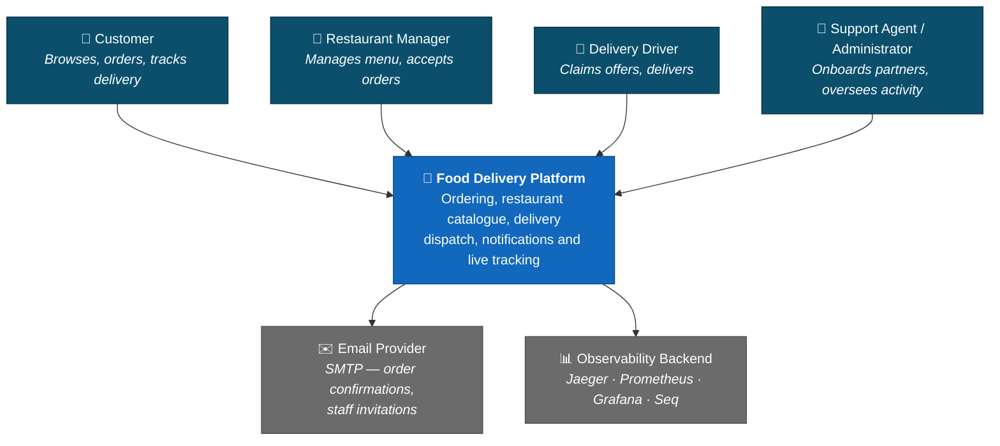
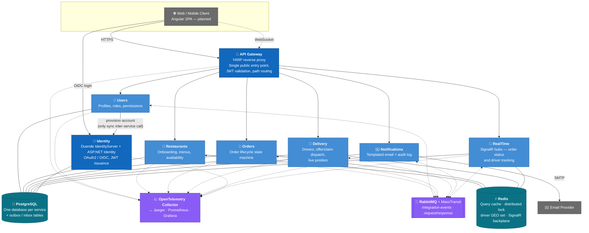

# Food Delivery Service

A production-shaped food delivery platform built as **.NET 10 microservices** behind a **YARP API gateway**, communicating asynchronously over **RabbitMQ/MassTransit** with the transactional **outbox/inbox** pattern, a **database-per-service** topology on PostgreSQL, **Redis** for caching and distributed locking, **SignalR** for live order and driver tracking, and full **OpenTelemetry** traces/metrics/logs.

It is a portfolio system, but it is not a toy: every service is independently deployable, no service reads another service's database, every cross-service state change travels as an integration event with an at-least-once delivery guarantee, and every module is covered by unit tests and by integration tests that run against real infrastructure.

The platform serves five user types — **Customers**, **Restaurant Managers**, **Delivery Drivers**, **Support Agents** and **Administrators** — through the full order lifecycle: browse restaurants → place an order → the kitchen accepts and prepares it → a driver is offered and claims the delivery → the customer tracks the driver live on a map → delivered.

---

## Table of Contents

- [Architecture](#architecture)
- [Tech Stack](#tech-stack)
- [Engineering Practices](#engineering-practices)
- [Feature Status](#feature-status)
- [Running It Locally](#running-it-locally)
- [Testing](#testing)
- [Repository Layout](#repository-layout)
- [Cloud Mapping](#cloud-mapping-azure)

---

## Architecture

### C1 — System Context

Who uses the platform and what it talks to.



### C2 — Container Diagram

Every box is an independently deployable process. **Solid arrows are synchronous HTTP; dashed arrows are asynchronous messages over RabbitMQ.** No service calls another service's API or database — the single exception is Users → Identity for account provisioning.



### How a request flows

1. The client hits the **Gateway** only. YARP validates the JWT issued by Duende, then routes by path prefix (`orders/**`, `restaurants/**`, `delivery/**`, `users/**`, …) to the owning service.
2. The service validates the JWT again (defence in depth) and resolves the caller's **permissions** — in non-Users services that is a MassTransit request/response call to Users, cached in Redis.
3. A Minimal API endpoint dispatches a **command** or **query** through MediatR. Commands go through EF Core repositories and return `Result<T>`; queries go through **Dapper** and never touch EF Core.
4. A domain event raised by an aggregate is written to that service's `outbox_messages` table **in the same transaction as the state change**. A Quartz job publishes it to RabbitMQ, consumers land it in their own `inbox_messages` table, and a second Quartz job dispatches the handler idempotently. Nothing is lost if a process dies mid-flight.
5. Every hop — HTTP, database, broker and both outbox/inbox handoffs — carries the same **correlation id and trace context**, so a single string finds the logs in Seq and the distributed trace in Jaeger.

---

## Tech Stack

| Area | Technology |
|---|---|
| **Runtime / language** | .NET 10, C#, ASP.NET Core Minimal APIs |
| **API gateway** | YARP reverse proxy |
| **Identity** | Duende IdentityServer, ASP.NET Identity, OAuth 2.0 / OIDC, JWT |
| **Messaging** | RabbitMQ + MassTransit (integration events, request/response, transactional outbox/inbox) |
| **Scheduling** | Quartz.NET (outbox/inbox dispatch, delivery-offer expiry) |
| **Data — writes** | Entity Framework Core, PostgreSQL, database-per-service, code-first migrations |
| **Data — reads** | Dapper (CQRS read side) |
| **Caching / coordination** | Redis — cache-aside query cache, distributed lock (`SET NX PX` + Lua release), driver GEO index, SignalR backplane |
| **Real-time** | SignalR (WebSockets) with JWT-secured hubs and Redis backplane |
| **Observability** | OpenTelemetry (traces + metrics) → OTel Collector → Jaeger / Prometheus / Grafana; Serilog → Seq; health probes on every host |
| **Validation** | FluentValidation via a MediatR pipeline behaviour |
| **Testing** | xUnit v3, AwesomeAssertions, Bogus, **Testcontainers** (ephemeral Postgres/Redis/RabbitMQ per test run) |
| **Containers / orchestration** | Docker, Docker Compose, Kubernetes manifests, KinD for local clusters |
| **CI** | GitHub Actions (build, test, manifest policy + `kubeconform` validation, cluster smoke test) |
| **Code quality** | Nullable reference types, `TreatWarningsAsErrors`, full Roslyn analysis mode, SonarAnalyzer |

---

## Engineering Practices

The architectural decisions behind the system, and the reasoning for each.

**Domain-Driven Design.** Aggregates have private constructors, private setters and static factory methods. Business rules live in the domain layer only — command handlers orchestrate, they do not decide. Every state change raises a domain event.

**CQRS.** Writes go through EF Core and a unit of work; reads go through Dapper against purpose-shaped SQL. The read and write paths are allowed to have different models and different performance characteristics.

**Railway-Oriented Programming.** Business failures are `Result<T>` values, not exceptions. Endpoints end in `result.Match(Results.Ok, ApiResults.Problem)`, which maps errors to RFC 7807 problem details. Exceptions are reserved for genuinely exceptional conditions.

**Transactional outbox / inbox.** The classic dual-write problem — "saved the order, then crashed before publishing the event" — is solved by persisting the event in the same transaction and dispatching it out of band, with idempotent handlers on the consume side.

**Data replication over synchronous calls.** Services keep local read replicas of the data they need (Orders holds a copy of customer data; Delivery holds copies of orders and restaurants), fed by full-snapshot integration events. A consumer never has to call back for more data, so an upstream outage degrades gracefully instead of cascading.

**Distributed locking for check-then-act writes.** Driver assignment reads availability, decides, then writes — a race that double-books a driver across replicas. A Redis lock guards it, acquired *before* the read, complementing (never replacing) the aggregate's own guard. Documented with the failure modes, including what happens when a lock is lost and nothing re-drives the entity.

**Cache invalidation as a first-class concern.** Menus are cached via an `ICachedQuery` marker and a pipeline behaviour, so handlers stay pure Dapper. Invalidation is inline in the command handler right after `SaveChangesAsync` — deliberately *not* an outbox-driven event handler, whose lag both delays freshness and republishes stale snapshots.

**Observability designed in, not bolted on.** One shared telemetry baseline for all eight hosts, RED metrics recorded automatically for every command and query, business metrics emitted next to the state changes that own them, correlation ids that survive both the broker and the two database handoffs, and a build-time test that fails if a Grafana dashboard or Prometheus alert references a metric nothing emits.

---

## Feature Status

Legend: **✅ Implemented** · **🚧 In Progress** · **📋 Pending**

### Phase 1 — Foundation

| Feature | Status | Notes |
|---|---|---|
| Solution structure, monorepo, Docker Compose | ✅ Implemented | 8 hosts + Postgres, Redis, RabbitMQ, Seq, Jaeger, OTel Collector, Prometheus, Grafana, blackbox |
| Identity service — registration, login, JWT, roles | ✅ Implemented | Duende IdentityServer; 5 roles; admin seeded from configuration |
| Staff/partner provisioning via emailed invitation | ✅ Implemented | One-time activation token; no temporary password is ever emailed |
| API Gateway with JWT validation and path routing | ✅ Implemented | YARP; all external traffic goes through it |
| Gateway rate limiting | 📋 Pending | |
| Restaurant service — onboarding, menus, availability | ✅ Implemented | Admin onboards restaurant + provisions its manager in one flow |
| Restaurant search, filtering and pagination | ✅ Implemented | |
| Order service — full lifecycle state machine | ✅ Implemented | Pending → Accepted/Rejected → Preparing → Ready → Out for Delivery → Delivered / Cancelled, with enforced transitions |
| Order placement idempotency | 📋 Pending | |
| Notification service — templated email + audit log | ✅ Implemented | Customer order confirmation and staff invitations |
| CI pipeline | 🚧 In Progress | GitHub Actions builds, tests, lints workflows and validates Kubernetes manifests; container publish and cloud deploy not yet wired |

### Phase 2 — Real-Time, Performance & Observability

| Feature | Status | Notes |
|---|---|---|
| Delivery service — driver profiles, availability, dispatch | ✅ Implemented | Offer/accept/reject/expire modelled on the Delivery aggregate with a Quartz expiry job |
| Live driver position tracking | ✅ Implemented | Redis GEO index; nearest-available-driver selection |
| Pickup/delivered flow closing the Order lifecycle | ✅ Implemented | Delivery events drive Orders to `OutForDelivery` → `Delivered` over the bus |
| Location history in Cosmos DB | 📋 Pending | Redis GEO covers the live-position use case today |
| Real-time order & driver tracking (SignalR) | ✅ Implemented | JWT-secured hubs, Redis backplane, dashboard groups derived from permission claims |
| Azure SignalR Service | 📋 Pending | |
| Redis caching — cache-aside helper, cached queries, invalidation | ✅ Implemented | Menu caching with inline invalidation; documented key/TTL conventions |
| Distributed locking | ✅ Implemented | Redis `SET NX PX` + token-checked Lua release, used on the driver-assignment race |
| Cache hit/miss metrics and graceful Redis degradation | ✅ Implemented | In-memory fallback in Development only |
| OpenTelemetry traces + metrics across all hosts | ✅ Implemented | Shared `AddHostTelemetry` baseline |
| Structured logging with correlation ids | ✅ Implemented | Serilog → Seq; correlation id defaults to the W3C trace id so one string finds both |
| Correlation across the outbox/inbox boundary | ✅ Implemented | Correlation columns on 11 outbox/inbox tables + linked dispatch spans |
| Metrics backend, dashboards and alerts as code | ✅ Implemented | OTel Collector → Prometheus → provisioned Grafana dashboards; blackbox probes every health endpoint |
| Health probes (`/health/live`, `/health/ready`) | ✅ Implemented | Documented contract, used by Kubernetes probes |
| Azure Monitor / Application Insights export | 📋 Pending | OpenTelemetry makes this a config change, not a code change |
| Kubernetes deployment | 🚧 In Progress | All 8 services as `kubectl` manifests, shared ConfigMap/Secret, verified on a local KinD cluster with a scripted smoke test; Helm, HPA, Ingress and AKS not built |
| Reviews & ratings | 📋 Pending | |

### Phase 3 — AI, Load Testing & Production Polish

| Feature | Status | Notes |
|---|---|---|
| Load testing & scalability demonstration | 📋 Pending | Planned with k6, driving scripted end-to-end user journeys |
| AI customer support chatbot (RAG) | 📋 Pending | |
| Personalised recommendations | 📋 Pending | |
| AI-powered dynamic ETA | 📋 Pending | |
| Fraud & anomaly detection | 📋 Pending | Planned as a dedicated service with behavioural projections and a rule-based risk score |
| Support service & ticketing | 📋 Pending | |
| Production hardening (security audit, docs, dependency scanning) | 📋 Pending | |

### Frontend

| Feature | Status | Notes |
|---|---|---|
| Angular SPA (signals, standalone components, Tailwind) | 📋 Pending | Plan written; backend prerequisites (CORS, roles claim) identified |

---

## Running It Locally

Requires Docker Desktop and the .NET 10 SDK.

```bash
cd Backend && docker compose up -d
```

That brings up all eight services plus PostgreSQL, Redis, RabbitMQ, Seq, Jaeger, the OpenTelemetry Collector, Prometheus, Grafana and the blackbox exporter. Database migrations are applied automatically at startup.

| Surface | URL |
|---|---|
| API Gateway (the only public entry point) | http://localhost:3000 |
| Identity (Duende) | http://localhost:18080 |
| Grafana dashboards | http://localhost:3100 |
| Prometheus | http://localhost:9090 |
| Jaeger traces | http://localhost:16686 |
| Seq logs | http://localhost:8081 |
| RabbitMQ management | http://localhost:15672 |

To build the solution:

```bash
cd Backend && dotnet build
```

Individual services are never exposed to clients directly — reach everything through the gateway.

---

## Testing

Two layers, both run in CI:

**Unit tests** (`{Module}.UnitTests`) reference the Domain project only. They cover aggregate factories, business methods, invariants and the domain events those methods must — and must not — raise. No DI, no database, no HTTP.

**Integration tests** (`{Module}.IntegrationTests`) drive the real HTTP endpoints through the complete pipeline against ephemeral PostgreSQL, Redis and RabbitMQ **Testcontainers**, authenticated with **real Duende-issued JWTs** rather than test doubles. Where a feature spans services, the other module's API is hosted in-process so cross-service event propagation is asserted end to end — an order placed in one service is verified to arrive as a replica in another.

```bash
cd Backend && dotnet test
```

These tests have earned their keep: the Users suite surfaced a real outbox serialization bug where a role collection silently broke `UserRegistered` publishing to every downstream consumer, and the first KinD cluster run exposed three latent bugs in the deployment scripts.

---

## Repository Layout

```
Backend/
├── src/
│   ├── API/                    # One host per service — Gateway, Identity, and six module hosts
│   ├── Common/                 # Domain / Application / Infrastructure / Presentation building blocks
│   └── Modules/{Name}/         # Domain · Application · Infrastructure · Presentation · IntegrationEvents (+ tests)
├── deploy/                     # Kubernetes manifests, KinD scripts, policy checks
├── docker/                     # OTel Collector, Prometheus rules, provisioned Grafana dashboards, blackbox
└── docs/                       # Caching, observability, health-probe contract, CAP trade-offs, ADRs
Frontend/                       # Angular SPA (planned)
```

Each module follows the same five-project shape, and a module's `IntegrationEvents` project is the **only** thing another service is ever allowed to reference.

Deeper write-ups live in [`Backend/docs/`](Backend/docs/): caching strategy and invalidation model, the observability architecture, the health-probe contract, CAP-theorem trade-offs for this topology, and the registration-flow architecture decisions.

---

## Cloud Mapping (Azure)

The system runs entirely on open-source infrastructure locally. Because every dependency sits behind an abstraction (MassTransit for the broker, OpenTelemetry for telemetry, `IDistributedCache`/`IDistributedLock` for Redis), moving to Azure PaaS is largely configuration rather than rewriting:

| Local | Azure equivalent | Status |
|---|---|---|
| RabbitMQ | Azure Service Bus (MassTransit transport swap) | 📋 Pending |
| Redis | Azure Cache for Redis (connection string change only) | 📋 Pending |
| PostgreSQL | Azure Database for PostgreSQL | 📋 Pending |
| OTel Collector → Prometheus/Jaeger | Azure Monitor / Application Insights (OTLP exporter change) | 📋 Pending |
| Kubernetes manifests on KinD | Azure Kubernetes Service | 📋 Pending |
| Docker images | Azure Container Registry | 📋 Pending |
| Compose secrets | Azure Key Vault | 📋 Pending |

The abstractions and the local-first choice are deliberate: everything is reproducible on a laptop with one command and costs nothing to run, while the path to managed services stays short.
