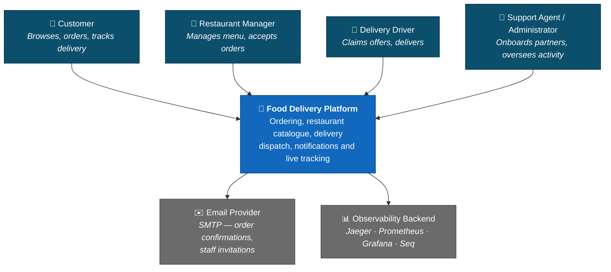
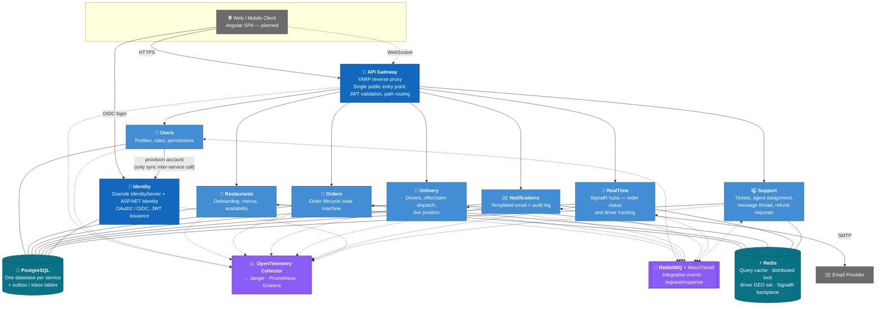
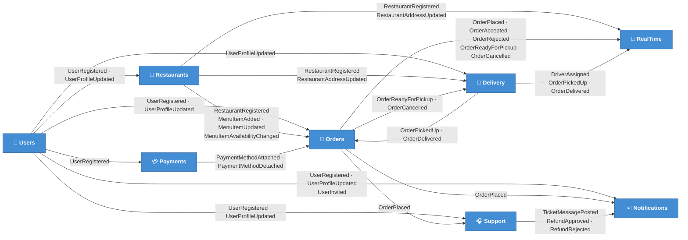

# Food Delivery Service

A production-shaped food delivery platform built as **.NET 10 microservices** behind a **YARP API gateway**, communicating asynchronously over **RabbitMQ/MassTransit** with the transactional **outbox/inbox** pattern, a **database-per-service** topology on PostgreSQL, **Redis** for caching and distributed locking, **SignalR** for live order and driver tracking, and full **OpenTelemetry** traces/metrics/logs.

It is a portfolio system, but it is not a toy: every service is independently deployable, no service reads another service's database, every cross-service state change travels as an integration event with an at-least-once delivery guarantee, and every module is covered by unit tests and by integration tests that run against real infrastructure.

The platform serves five user types — **Customers**, **Restaurant Managers**, **Delivery Drivers**, **Support Agents** and **Administrators** — through the full order lifecycle: browse restaurants → place an order → the kitchen accepts and prepares it → a driver is offered and claims the delivery → the customer tracks the driver live on a map → delivered.

---

## Table of Contents

- [Architecture](#architecture)
- [Tech Stack](#tech-stack)
- [Engineering Practices](#engineering-practices)
- [Feature Status](#feature-status)
- [Running It Locally](#running-it-locally)
- [API Documentation](#api-documentation)
- [Security](#security)
- [Testing](#testing)
- [Load Testing](#load-testing)
- [Repository Layout](#repository-layout)
- [Cloud Mapping](#cloud-mapping-azure)

---

## Architecture

### C1 — System Context

Who uses the platform and what it talks to.



### C2 — Container Diagram

Every box is an independently deployable process. **Solid arrows are synchronous HTTP; dashed arrows are asynchronous messages over RabbitMQ.** No service calls another service's API or database — the single exception is Users → Identity for account provisioning.



### How a request flows

1. The client hits the **Gateway** only. YARP validates the JWT issued by Duende, then routes by path prefix (`orders/**`, `restaurants/**`, `delivery/**`, `users/**`, …) to the owning service. Between authentication and routing sits the **edge rate limiter**: a global concurrency cap plus a per-client fixed window partitioned by subject (IP when anonymous), sized per route tier so browsing is shed before an order or a delivery lifecycle transition is. Its counters live in Redis, because per-pod buckets would multiply the limit by the replica count.
2. The service validates the JWT again (defence in depth) and resolves the caller's **permissions** — in non-Users services that is a MassTransit request/response call to Users, cached in Redis.
3. A Minimal API endpoint dispatches a **command** or **query** through MediatR. Commands go through EF Core repositories and return `Result<T>`; queries go through **Dapper** and never touch EF Core.
4. A domain event raised by an aggregate is written to that service's `outbox_messages` table **in the same transaction as the state change**. A Quartz job publishes it to RabbitMQ, consumers land it in their own `inbox_messages` table, and a second Quartz job dispatches the handler idempotently. Nothing is lost if a process dies mid-flight.
5. Every hop — HTTP, database, broker and both outbox/inbox handoffs — carries the same **correlation id and trace context**, so a single string finds the logs in Seq and the distributed trace in Jaeger.

### C3 — Event Topology

The C2 diagram draws one dashed line per service to a RabbitMQ box, which is honest about the transport and says nothing about the system. This is what actually travels those lines: **27 integration events**, who publishes each and who reacts to it.

**The hop every one of them takes.** Nothing publishes to the broker from a command handler. A state change and the record of that state change are committed together, and everything after that is out of band:

```mermaid
graph LR
    agg["🧱 Aggregate<br/><i>Raise(OrderPlacedDomainEvent)</i>"]
    tx[("💾 <b>One transaction</b><br/>orders + outbox_messages<br/><i>InsertOutboxMessagesInterceptor</i>")]
    ojob["⏱️ ProcessOutboxJob<br/><i>Quartz · SELECT … FOR UPDATE SKIP LOCKED</i>"]
    deh["🧭 Domain event handler<br/><i>builds the full-snapshot<br/>integration event</i>"]
    bus[["🐇 <b>RabbitMQ</b><br/><i>MassTransit publish</i>"]]
    cons["📥 IntegrationEventConsumer&lt;T&gt;<br/><i>one queue per consuming service</i>"]
    inbox[("💾 inbox_messages")]
    ijob["⏱️ ProcessInboxJob<br/><i>Quartz</i>"]
    ieh["🎯 IIntegrationEventHandler&lt;T&gt;<br/><i>wrapped idempotent</i>"]

    agg --> tx --> ojob --> deh --> bus --> cons --> inbox --> ijob --> ieh

    classDef write fill:#0b7285,stroke:#075162,color:#fff
    classDef job fill:#8a5cf6,stroke:#5b34b0,color:#fff
    classDef code fill:#438dd5,stroke:#2e6295,color:#fff
    class tx,inbox write
    class ojob,ijob,bus job
    class agg,deh,cons,ieh code
```



Delivery is at-least-once in both directions: the outbox job may publish an event twice if it dies after the broker ack and before the row update, and the inbox job may dispatch twice for the same reason — which is why every handler is wrapped idempotent and why every event carries a **full snapshot** rather than a delta. A consumer never calls back for more data, so an upstream outage degrades a replica's freshness instead of failing a request.

**Who publishes what, and who listens.** Edge labels are the events, minus their `IntegrationEvent` suffix:



Three things the picture makes obvious that the prose does not:

- **The lifecycle is a loop, not a chain.** Orders tells Delivery an order is ready; Delivery tells Orders it was picked up and delivered, and *those* events are what move the order to `OutForDelivery` and `Delivered`. Neither service calls the other.
- **Notifications and RealTime only ever consume.** They publish nothing. Both are pure projections of other services' state — one into email, one into SignalR frames — which is why either can be down without blocking a single write.
- **Six events are published that nothing consumes yet.** Delivery's `DeliveryOffered`, `DeliveryOfferRejected` and `DeliveryUnassigned`, and Support's `SupportTicketOpened`, `SupportTicketResolved` and `RefundRequested`. They are the audit and extension surface — an offer's lifecycle and a refund's approval chain are worth publishing whether or not anything listens today — and they are named here rather than omitted, because a topology diagram that quietly drops the unconsumed half is a diagram of what someone wished the system did.

`IntegrationEventTopologyTests` parses this section against the `IntegrationEvents` projects and the `ConfigureConsumers` registrations, so an event added, renamed or newly consumed fails the build here instead of silently ageing the picture.

---

## Tech Stack

| Area | Technology |
|---|---|
| **Runtime / language** | .NET 10, C#, ASP.NET Core Minimal APIs |
| **API gateway** | YARP reverse proxy |
| **Identity** | Duende IdentityServer, ASP.NET Identity, OAuth 2.0 / OIDC, JWT |
| **Messaging** | RabbitMQ + MassTransit (integration events, request/response, transactional outbox/inbox) |
| **Scheduling** | Quartz.NET (outbox/inbox dispatch, delivery-offer expiry) |
| **Data — writes** | Entity Framework Core, PostgreSQL, database-per-service, code-first migrations |
| **Data — reads** | Dapper (CQRS read side) |
| **Caching / coordination** | Redis — cache-aside query cache, distributed lock (`SET NX PX` + Lua release), driver GEO index, SignalR backplane |
| **Real-time** | SignalR (WebSockets) with JWT-secured hubs and Redis backplane |
| **Observability** | OpenTelemetry (traces + metrics) → OTel Collector → Jaeger / Prometheus / Grafana; Serilog → Seq; health probes on every host |
| **Validation** | FluentValidation via a MediatR pipeline behaviour |
| **Testing** | xUnit v3, AwesomeAssertions, Bogus, **Testcontainers** (ephemeral Postgres/Redis/RabbitMQ per test run) |
| **Load testing** | k6 — scripted end-to-end journeys under arrival-rate profiles, streamed live into the same Prometheus/Grafana the platform uses |
| **Containers / orchestration** | Docker, Docker Compose, Kubernetes manifests, KinD for local clusters |
| **CI** | GitHub Actions (build, test, manifest policy + `kubeconform` validation, cluster smoke test) |
| **Code quality** | Nullable reference types, `TreatWarningsAsErrors`, full Roslyn analysis mode, SonarAnalyzer |

---

## Engineering Practices

The architectural decisions behind the system, and the reasoning for each.

**Domain-Driven Design.** Aggregates have private constructors, private setters and static factory methods. Business rules live in the domain layer only — command handlers orchestrate, they do not decide. Every state change raises a domain event.

**CQRS.** Writes go through EF Core and a unit of work; reads go through Dapper against purpose-shaped SQL. The read and write paths are allowed to have different models and different performance characteristics.

**Railway-Oriented Programming.** Business failures are `Result<T>` values, not exceptions. Endpoints end in `result.Match(Results.Ok, ApiResults.Problem)`, which maps errors to RFC 7807 problem details. Exceptions are reserved for genuinely exceptional conditions.

**Transactional outbox / inbox.** The classic dual-write problem — "saved the order, then crashed before publishing the event" — is solved by persisting the event in the same transaction and dispatching it out of band, with idempotent handlers on the consume side.

**Data replication over synchronous calls.** Services keep local read replicas of the data they need (Orders holds a copy of customer data; Delivery holds copies of orders and restaurants), fed by full-snapshot integration events. A consumer never has to call back for more data, so an upstream outage degrades gracefully instead of cascading.

**Distributed locking for check-then-act writes.** Driver assignment reads availability, decides, then writes — a race that double-books a driver across replicas. A Redis lock guards it, acquired *before* the read, complementing (never replacing) the aggregate's own guard. Documented with the failure modes, including what happens when a lock is lost and nothing re-drives the entity.

**Cache invalidation as a first-class concern.** Menus are cached via an `ICachedQuery` marker and a pipeline behaviour, so handlers stay pure Dapper. Invalidation is inline in the command handler right after `SaveChangesAsync` — deliberately *not* an outbox-driven event handler, whose lag both delays freshness and republishes stale snapshots.

**Observability designed in, not bolted on.** One shared telemetry baseline for all nine hosts, RED metrics recorded automatically for every command and query, business metrics emitted next to the state changes that own them, correlation ids that survive both the broker and the two database handoffs, and a build-time test that fails if a Grafana dashboard or Prometheus alert references a metric nothing emits.

---

## Feature Status

Legend: **✅ Implemented** · **🚧 In Progress** · **📋 Pending**

### Phase 1 — Foundation

| Feature | Status | Notes |
|---|---|---|
| Solution structure, monorepo, Docker Compose | ✅ Implemented | 9 hosts — Gateway, Identity, Users, Restaurants, Orders, Delivery, Notifications, RealTime, Support — plus Postgres, Redis, RabbitMQ, Seq, Jaeger, OTel Collector, Prometheus, Grafana, blackbox |
| Identity service — registration, login, JWT, roles | ✅ Implemented | Duende IdentityServer; 5 roles; admin seeded from configuration |
| Staff/partner provisioning via emailed invitation | ✅ Implemented | One-time activation token; no temporary password is ever emailed |
| API Gateway with JWT validation and path routing | ✅ Implemented | YARP; all external traffic goes through it |
| Gateway rate limiting | ✅ Implemented | Redis-backed, route-tiered admission control at the edge; measured to turn a collapse past the knee into a plateau |
| Restaurant service — onboarding, menus, availability | ✅ Implemented | Admin onboards restaurant + provisions its manager in one flow |
| Restaurant search, filtering and pagination | ✅ Implemented | |
| Order service — full lifecycle state machine | ✅ Implemented | Pending → Accepted/Rejected → Preparing → Ready → Out for Delivery → Delivered / Cancelled, with enforced transitions |
| Order placement idempotency | ✅ Implemented | `POST /orders` takes an `Idempotency-Key` header; a replay returns the original order rather than placing a second one |
| Notification service — templated email + audit log | ✅ Implemented | Customer order confirmation and staff invitations |
| CI pipeline | 🚧 In Progress | Four GitHub Actions jobs: build + test, tooling gates (`actionlint`, `kubeconform`, manifest policy), a `gitleaks` secret scan, and a KinD cluster smoke test. **Not wired:** container publish, cloud deploy, and any supply-chain scanning — no Dependabot, no CodeQL, no image scan (see [Security](#security)) |

### Phase 2 — Real-Time, Performance & Observability

| Feature | Status | Notes |
|---|---|---|
| Delivery service — driver profiles, availability, dispatch | ✅ Implemented | Offer/accept/reject/expire modelled on the Delivery aggregate with a Quartz expiry job |
| Live driver position tracking | ✅ Implemented | Redis GEO index; nearest-available-driver selection |
| Pickup/delivered flow closing the Order lifecycle | ✅ Implemented | Delivery events drive Orders to `OutForDelivery` → `Delivered` over the bus |
| Location history in Cosmos DB | 📋 Pending | Redis GEO covers the live-position use case today |
| Real-time order & driver tracking (SignalR) | ✅ Implemented | JWT-secured hubs, Redis backplane, dashboard groups derived from permission claims |
| Azure SignalR Service | 📋 Pending | |
| Redis caching — cache-aside helper, cached queries, invalidation | ✅ Implemented | Menu caching with inline invalidation; documented key/TTL conventions |
| Distributed locking | ✅ Implemented | Redis `SET NX PX` + token-checked Lua release, used on the driver-assignment race |
| Cache hit/miss metrics and graceful Redis degradation | ✅ Implemented | In-memory fallback in Development only |
| OpenTelemetry traces + metrics across all hosts | ✅ Implemented | Shared `AddHostTelemetry` baseline |
| Structured logging with correlation ids | ✅ Implemented | Serilog → Seq; correlation id defaults to the W3C trace id so one string finds both |
| Correlation across the outbox/inbox boundary | ✅ Implemented | Correlation columns on 11 outbox/inbox tables + linked dispatch spans |
| Metrics backend, dashboards and alerts as code | ✅ Implemented | OTel Collector → Prometheus → provisioned Grafana dashboards; blackbox probes every health endpoint |
| Health probes (`/health/live`, `/health/ready`) | ✅ Implemented | Documented contract, used by Kubernetes probes |
| Azure Monitor / Application Insights export | 📋 Pending | OpenTelemetry makes this a config change, not a code change |
| Kubernetes deployment | 🚧 In Progress | All 9 services as `kubectl` manifests, shared ConfigMap/Secret, verified on a local KinD cluster with a scripted smoke test; Helm, HPA, Ingress and AKS not built |
| Reviews & ratings | 📋 Pending | |

### Phase 3 — AI, Load Testing & Production Polish

| Feature | Status | Notes |
|---|---|---|
| Load testing & scalability demonstration | ✅ Implemented | k6 harness driving five end-to-end journeys through the Gateway; knee located, three bottlenecks measured and fixed — see [Load Testing](#load-testing) |
| AI customer support chatbot (RAG) | 📋 Pending | |
| Personalised recommendations | 📋 Pending | |
| AI-powered dynamic ETA | 📋 Pending | |
| Fraud & anomaly detection | 📋 Pending | Designed as a dedicated service with behavioural projections and a rule-based risk score; built once and **reverted** — no code for it is in the repository |
| Support service & ticketing | ✅ Implemented | Tickets and their lifecycle, agent assignment under a distributed lock, an append-only audit log written in the same transaction as the change it records, the agent↔customer message thread, and refund requests where one agent asks and a *different* administrator decides — see the [support ticketing reference](Backend/docs/support-ticketing.md) |
| Production hardening (security audit, docs) | ✅ Implemented | Authorization coverage and IDOR asserted as tests, least-privilege database roles, edge security headers/CORS/forwarded headers, Identity hardening, validator coverage, and OpenAPI docs on every service — see [Security](#security) and [API Documentation](#api-documentation). **Dependency scanning was descoped**: build-time NuGet audit only |

### Frontend

| Feature | Status | Notes |
|---|---|---|
| Angular SPA (signals, standalone components, Tailwind) | 📋 Pending | Plan written; backend prerequisites (CORS, roles claim) identified |

---

## Running It Locally

Requires Docker Desktop and the .NET 10 SDK.

```bash
cd Backend && docker compose up -d
```

That brings up all nine services plus PostgreSQL, Redis, RabbitMQ, Seq, Jaeger, the OpenTelemetry Collector, Prometheus, Grafana and the blackbox exporter. Database migrations are applied automatically at startup.

| Surface | URL |
|---|---|
| API Gateway (the only public entry point) | http://localhost:3000 |
| Identity (Duende) | http://localhost:18080 |
| Grafana dashboards | http://localhost:3100 |
| Prometheus | http://localhost:9090 |
| Jaeger traces | http://localhost:16686 |
| Seq logs | http://localhost:8081 |
| RabbitMQ management | http://localhost:15672 |

To build the solution:

```bash
cd Backend && dotnet build
```

Individual services are never exposed to clients directly — reach everything through the gateway.

---

## API Documentation

Every service publishes an OpenAPI document generated from its real endpoint metadata, with **Scalar** and Swagger UI in front of it. The Gateway proxies all of them, so one origin reaches every service's reference:

| Service | Reference |
|---|---|
| Orders | http://localhost:3000/docs/orders |
| Restaurants | http://localhost:3000/docs/restaurants |
| Users | http://localhost:3000/docs/users |
| Delivery | http://localhost:3000/docs/delivery |
| Support | http://localhost:3000/docs/support |
| RealTime | http://localhost:3000/docs/realtime |
| Notifications | http://localhost:3000/docs/notifications |

Each slug serves three surfaces: `/docs/{slug}/scalar`, `/docs/{slug}/swagger`, and the raw document at `/docs/{slug}/openapi/v1.json`. They are mapped in every environment and require a bearer token outside Development.

Two details are worth the click. **The permission line is read off the endpoint, never retyped** — `**Requires permission:** orders:manage` is pulled from the `RequireAuthorization` policy, and a separate test fails the build if a policy names a permission the Users service does not seed, so the string in the document is one something has checked. And **the document is asserted complete**: `OpenApiDocumentTests` builds each service's real document in memory and fails an operation missing a summary, a description, a tag or a success response. Two documents are legitimately empty — Notifications has no HTTP surface, and a SignalR hub contributes no `ApiDescription` however it is annotated.

Design and conventions: [`Backend/docs/api-documentation.md`](Backend/docs/api-documentation.md).

---

## Security

The security posture is written down and, where it can be, asserted as tests rather than described: [`Backend/docs/security.md`](Backend/docs/security.md) is the reference, including an OWASP Top 10 pass that names the file each guardrail lives in.

**Authentication and authorization.** Duende IdentityServer issues the JWTs; the Gateway validates them and every service validates them again. Authorization is **permission-based, not role-based** — a policy names `orders:manage`, and non-Users services resolve a caller's permissions over the bus and cache the answer in Redis for five minutes.

**What is enforced by a failing build**, not by review:

| Guardrail | What it prevents |
|---|---|
| `EndpointAuthorizationTests` | An endpoint shipped with no authorization, or naming a permission nothing seeds |
| `GatewayRouteTests` | A module host with no gateway route — reachable only on its container port, outside JWT validation and the rate limiter — or a route naming a cluster that is not defined |
| `ValidatorCoverageTests` | A reachable request with no validator — the validation behaviour silently no-ops without one — an unbounded free-text field, or an uncapped page size |
| `SqlParameterisationTests` | A SQL literal that is not `const`, which is what proves no runtime value can be interpolated into a statement |
| `DatabaseRoleTests` | A host wired to the migration credential for its runtime queries |
| `SecurityHeaderCoverageTests` | A host missing the security headers, or a module host that acquires the Gateway-only CORS and forwarded-headers middleware |

**Least privilege at the database.** Each service has two credentials that are not interchangeable: an owner role used only by the startup migration, and an app role with `SELECT/INSERT/UPDATE/DELETE` on its own database and nothing else. `REVOKE CONNECT` makes "no service reads another service's database" a server guarantee rather than a convention.

**At the edge.** Security response headers on every host (`nosniff`, `DENY` framing, `no-referrer`, a `default-src 'none'` CSP); CORS and forwarded headers on the Gateway only, with forwarded headers trusting nothing until a proxy network is configured — without which the rate limiter's anonymous partition collapses into a single bucket behind a proxy.

**Known limitations, stated rather than discovered.** TLS terminates outside anything this repository deploys, so there is no in-repo certificate or Ingress; there is no WAF and no penetration test, because there is no deployed environment to point one at; a revoked permission has up to five minutes of lag from the cache; the JWT carries no role claim, so gateway-level RBAC is an [architectural decision documented in `docs/security.md` §6.5](Backend/docs/security.md), not an implemented feature. And **dependency scanning is build-time only** — the NuGet audit runs as warnings-as-errors, so a vulnerable package fails the build, but nothing is scheduled: an advisory published against an already-pinned package produces no signal until somebody builds, and the nine container base images are never scanned at all. Dependabot, CodeQL and image scanning were considered and descoped.

---

## Testing

Two layers, both run in CI:

**Unit tests** (`{Module}.UnitTests`) reference the Domain project only. They cover aggregate factories, business methods, invariants and the domain events those methods must — and must not — raise. No DI, no database, no HTTP.

**Integration tests** (`{Module}.IntegrationTests`) drive the real HTTP endpoints through the complete pipeline against ephemeral PostgreSQL, Redis and RabbitMQ **Testcontainers**, authenticated with **real Duende-issued JWTs** rather than test doubles. Where a feature spans services, the other module's API is hosted in-process so cross-service event propagation is asserted end to end — an order placed in one service is verified to arrive as a replica in another.

```bash
cd Backend && dotnet test
```

These tests have earned their keep: the Users suite surfaced a real outbox serialization bug where a role collection silently broke `UserRegistered` publishing to every downstream consumer, and the first KinD cluster run exposed three latent bugs in the deployment scripts.

---

## Load Testing

Correctness tests say the platform does the right thing. Load testing asks a different question — *how much of it, before what breaks first* — and it is answered here with a **k6 harness** (`Backend/loadtest/`) that drives the real journeys through the Gateway against the running stack, with the platform's own telemetry as the second witness.

### How a run is performed

**1. Seed a deterministic dataset.** A .NET seeder (`Backend/tools/FoodDeliveryService.LoadTest.Seeder`) creates 20 restaurants × 24 menu items, 500 customers and 50 drivers **through the public API** — never by inserting rows, because a direct insert skips the outbox and the replicas the order path depends on would never arrive. It waits for a probe order to succeed before writing `fixtures/seed.json`, so a run can never start against ids the platform cannot yet resolve. The dataset is generated from a fixed Bogus seed, so the same world is reproducible.

**2. Drive all five journeys at once.** Each journey is a script; `mixed.js` composes them, because measuring one endpoint measures an endpoint, not a platform.

| Script | Actor | What it does |
|---|---|---|
| `browse.js` | customer | list → detail → menu — 70% of customer traffic |
| `order.js` | customer | browse, then `POST /orders`; ~1% deliberately replay an idempotency key |
| `track.js` | customer | poll the order and its delivery — the worst read amplification per order |
| `restaurant.js` | manager | dashboard poll → one lifecycle step per order — *without it nothing leaves `Pending`* |
| `driver.js` | driver | position report → claim an offer → picked up → delivered — *without it nothing reaches `Delivered`* |

The three customer journeys run under **`constant-arrival-rate`**, not a fixed pool of virtual users. A closed loop issues its next request only after the previous one returns, so as the system slows the offered load falls with it and a saturated system reports itself as merely slow. Real customers do not slow down because the site is slow. The two operator journeys are correctly `constant-vus` — a kitchen has a fixed number of staff — because they are supply, not demand.

**3. Pick a profile.** A profile is the *shape* of a run, held as data in `config/profiles.js` so that adding a test type is a config entry rather than a new script, and two runs of one profile are comparable by construction.

| Profile | Shape | The question it answers |
|---|---|---|
| `baseline` | 2 arrivals/s, 5 min | What does an unloaded request cost? Everything else is read against this. |
| `ramp` | 2 → 32/s in 8 steps of 90 s | **Where is the knee?** |
| `spike` | 2/s → 20/s for 60 s → 2/s | Does it recover, and how fast does the queue drain? |
| `soak` | 4/s for 2 h | Do memory, connections or the outbox backlog grow without bound? |

Every staged profile tags each request with its phase and declares thresholds **per phase**, which makes saturation mechanical instead of a debate about a graph: the first step whose journey `p(95)` goes red *is* the knee, printed in the terminal. The first phase is always an ungated `warm` — an early run attributed a knee to its own ignition burst (VU startup plus a cold permission cache), and a warm-up phase is the fix.

```bash
cd Backend/loadtest/scripts && ./run.sh scenarios/mixed.js --profile ramp
```

**4. Declare saturation against fixed criteria, then find the saturated component from the platform, not from k6.** A step saturates when journey p95 crosses the SLO, *or* errors exceed 1%, *or* a backlog metric grows monotonically across the whole step. k6 only says *that* it slowed down; RED metrics per service, cache hit ratio, RabbitMQ depth, the unprocessed `outbox_messages` count and `pg_stat_activity` say *where*. Every run records the environment beside its numbers, and every published figure keeps its run artifact in `loadtest/results/published/` — a number with no artifact behind it is an assertion.

Two design decisions keep the results honest. A `429` from the rate limiter is counted as an **answer**, not a failure — otherwise the guardrail would fail the very test that motivated it — and is reported as a separate shed fraction that must be quoted next to any percentile taken from a step where it was non-zero, since refused requests are cheap and always flatter a p95. And every virtual user logs in **once**, cached in VU-local state: PBKDF2 is deliberately expensive, so a script that authenticates per iteration turns the whole exercise into a password-hashing benchmark of one service.

### What it measured

> compose · 8 vCPU · 7.6 GB to Docker · **1 replica per service** · **generator co-located on the same machine**. These numbers do not transfer to other hardware, and above roughly half the host's cores they describe the contest between the platform and its own load generator.

At **baseline** (2 arrivals/s, five minutes): 8,211 requests at 24.4/s, journey **p50 8.5 ms · p95 31.3 ms · p99 77.3 ms** against a 500 ms SLO, `POST /orders` p95 59.2 ms, **0.00%** errors. Run back to back, two baselines agree on journey p95 to **1.8%** — which is what makes anything else worth quoting.

**The knee is between 26 and 32 arrivals/s on this environment, and the component that saturates first is host CPU** — eight cores shared between the services, Postgres, Redis, RabbitMQ, the tracing stack *and the generator*. The largest single consumer at the knee was password hashing: Identity took 2.3 of the 8 cores issuing tokens against roughly 3 for the entire application path. That makes every figure here a **lower bound**, since every virtual user signs in while a real population is mostly returning users holding tokens.


Past the knee the platform used to collapse; it now sheds. Same ramp, same machine, same afternoon, one variable — the Gateway's admission control. Without it, the 32/s step served **1,968** requests, a seventh of what the 26/s step served while offered load *rose* by a quarter, and 32.4% of that step failed. With it, the same step served **17,060** at p95 **554 ms**, refusing 4.99% to do it — and because shedding is ranked by route, of 1,581 rejections not one was an order or a delivery lifecycle transition.

### Three bottlenecks found, one fix reverted

Each was measured with a before/after of the same profile on the same machine, one variable at a time:

- **The event pipeline had no index.** The outbox/inbox dispatch query sequentially scanned tables that only grow — 2,567 buffers and 16.05 ms per probe, twice per module per tick. A partial index took it to **1 buffer and 0.125 ms**; the backlog drain went 2.96 → 9.44 rows/s and order-placement failures 2.09% → 0%.
- **Every connection pool was unbounded.** Seven hosts × two pools × Npgsql's default of 100, against a Postgres running `max_connections=100`, produced **678 "sorry, too many clients already"** in three minutes with 80 of 88 backends *idle*. Bounding them took journey p99 from 2.31 s to 1.15 s.
- **The obvious cache was not the problem.** The one uncached browse query measured 242 ms against 26 ms for its cached neighbours — until the connection fix landed, after which the same query measured **26.3 ms**. The 9× gap was 12%: it had never been a missing cache, it was a query holding a connection while the pool starved. The cache was written, measured, and **reverted**.

That last one is the most useful entry in the log, and the reason to read it: the first bottleneck in a queue makes every component behind it look guilty.

### What this does *not* claim

A single-replica stack on eight shared cores will not serve 100,000 concurrent users. What was measured is ~**190 journey requests/second** and ~**2.6 orders/second** per stack of that size at p95 554 ms while shedding 5%. 100,000 concurrent users acting once every 30 seconds is on the order of 3,300 requests/second — roughly **17–20 such stacks**, *if* the single Postgres, Redis and RabbitMQ behind them scale too, which this work did not measure because host CPU saturated first. Running more than one replica is blocked on three specific hazards, one of which this work fixed (`FOR UPDATE` without `SKIP LOCKED` on all eleven dispatch queries) and two of which are open and named.

**The full method, every threshold, the complete bottleneck log including the fixes that did not work, and how to reproduce any number above:** [`Backend/docs/load-testing.md`](Backend/docs/load-testing.md). The harness runbook is [`Backend/loadtest/README.md`](Backend/loadtest/README.md); the guardrail's design is [`Backend/docs/rate-limiting.md`](Backend/docs/rate-limiting.md).

---

## Repository Layout

```
Backend/
├── src/
│   ├── API/                    # One host per service — Gateway, Identity, and seven module hosts
│   ├── Common/                 # Domain / Application / Infrastructure / Presentation building blocks
│   └── Modules/{Name}/         # Domain · Application · Infrastructure · Presentation · IntegrationEvents (+ tests)
├── deploy/                     # Kubernetes manifests, KinD scripts, policy checks
├── docker/                     # OTel Collector, Prometheus rules, provisioned Grafana dashboards, blackbox
├── loadtest/                   # k6 harness — journeys, profiles, thresholds, published run artifacts
├── tools/                      # The deterministic load-test dataset seeder
└── docs/                       # Caching, observability, rate limiting, load testing, support, health probes, ADRs
Frontend/                       # Angular SPA (planned)
```

Each module follows the same five-project shape, and a module's `IntegrationEvents` project is the **only** thing another service is ever allowed to reference.

Deeper write-ups live in [`Backend/docs/`](Backend/docs/): caching strategy and invalidation model, the observability architecture, the edge rate-limiting design, the full load-testing record, the [support ticketing reference](Backend/docs/support-ticketing.md) (state machine, permission matrix, audit-log guarantees, why refunds move no money), the health-probe contract, CAP-theorem trade-offs for this topology, and the registration-flow architecture decisions.

---

## Cloud Mapping (Azure)

The system runs entirely on open-source infrastructure locally. Because every dependency sits behind an abstraction (MassTransit for the broker, OpenTelemetry for telemetry, `IDistributedCache`/`IDistributedLock` for Redis), moving to Azure PaaS is largely configuration rather than rewriting:

| Local | Azure equivalent | Status |
|---|---|---|
| RabbitMQ | Azure Service Bus (MassTransit transport swap) | 📋 Pending |
| Redis | Azure Cache for Redis (connection string change only) | 📋 Pending |
| PostgreSQL | Azure Database for PostgreSQL | 📋 Pending |
| OTel Collector → Prometheus/Jaeger | Azure Monitor / Application Insights (OTLP exporter change) | 📋 Pending |
| Kubernetes manifests on KinD | Azure Kubernetes Service | 📋 Pending |
| Docker images | Azure Container Registry | 📋 Pending |
| Compose secrets | Azure Key Vault | 📋 Pending |

The abstractions and the local-first choice are deliberate: everything is reproducible on a laptop with one command and costs nothing to run, while the path to managed services stays short.
